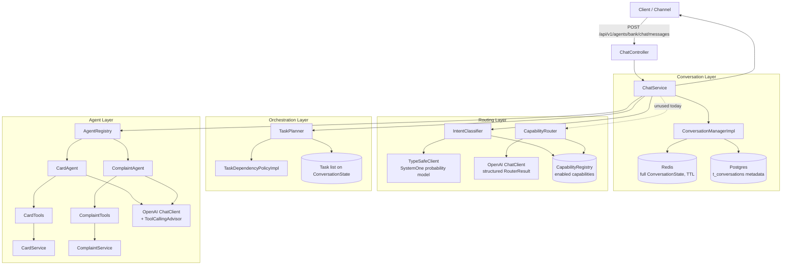
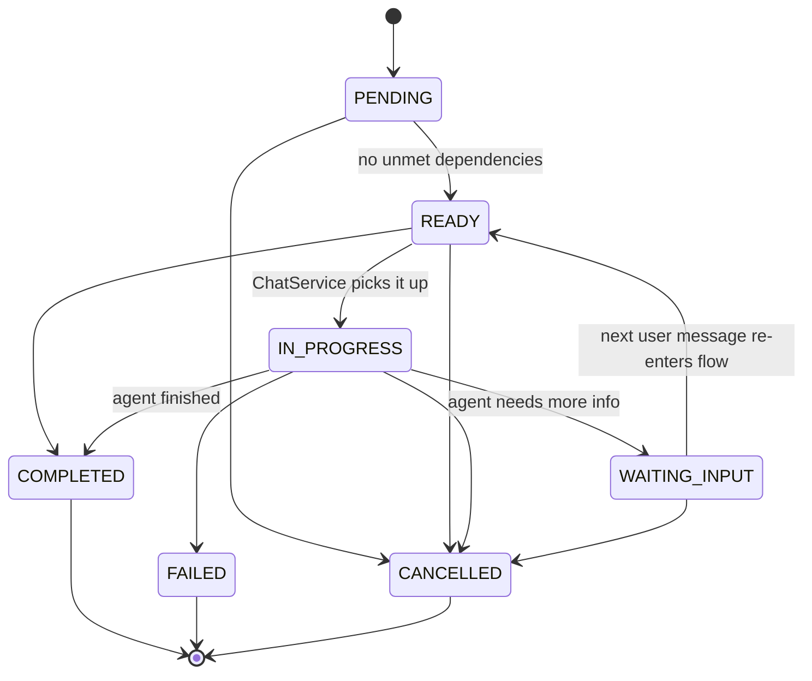
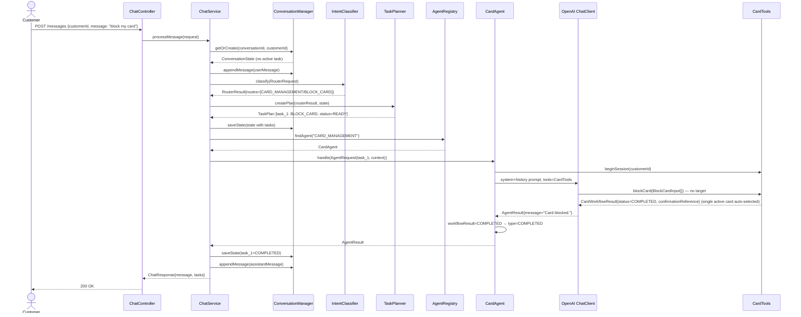
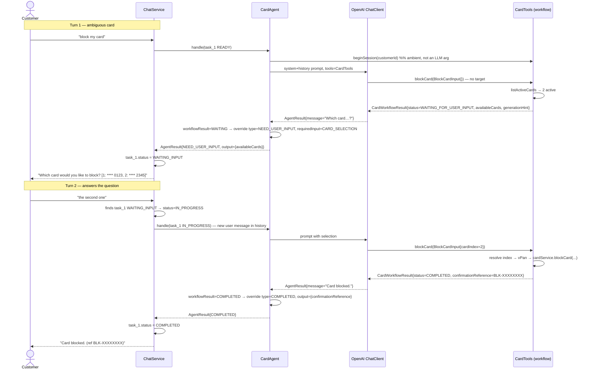
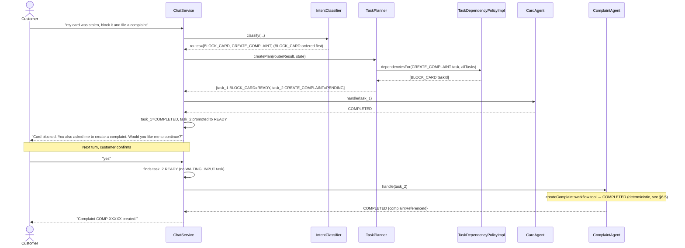
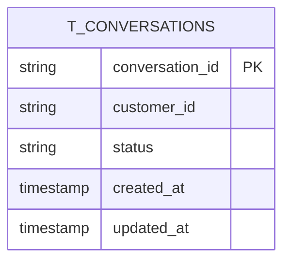

# Conversational Banking — Architecture Guide

This document is the fast on-ramp for any developer joining the project. It explains what the
service does, how requests flow through the system, how the code is organized, and where to
plug in new functionality. Read this once before your first PR.

## 1. What this service does

`conversational-banking` is a Spring Boot service that exposes a single chat endpoint. A customer
sends a free-text banking request (e.g. *"my card got stolen"*), and the service:

1. Classifies the intent against a fixed list of **enabled capabilities** (e.g. `BLOCK_CARD`, `CREATE_COMPLAINT`).
2. Turns the matched capabilities into an ordered **task plan** (some tasks depend on others).
3. Executes tasks one at a time by handing them to the right **domain agent** (Card, Complaint, ...).
4. Each domain agent is itself an LLM (via Spring AI `ChatClient`) equipped with domain-specific
   **tools** (functions) that call the (currently mocked) banking services.
5. Conversation state (messages + tasks) is cached in Redis and conversation metadata is
   durably stored in Postgres.

Everything is orchestrated synchronously inside a single HTTP request — there is no async queue
or background worker (yet).

## 2. Tech stack

| Concern | Choice |
|---|---|
| Language / runtime | Java 21 |
| Framework | Spring Boot 4.1.1 (Spring MVC, `spring-boot-starter-webmvc`) |
| LLM integration | Spring AI 2.0.1 (`ChatClient`, OpenAI model, `@Tool` function calling) |
| Intent classification | `spring-ai-community` **typesafe-spring-ai** (`TypeSafeClient` / "SystemOne" probability questions) |
| Durable storage | PostgreSQL via Spring Data JPA (conversation metadata only) |
| Fast/session storage | Redis via `RedisTemplate` (full conversation state, JSON, TTL-based) |
| API docs | springdoc-openapi (Swagger UI) |
| Build | Maven (`mvnw`) |
| Notifications | Pushover REST client (`PushOverService`) — implemented, not yet wired into any flow |

## 3. High-level architecture



Key point: **`ChatService` is the orchestrator.** There is no separate workflow engine — it directly
coordinates conversation state, routing, planning, and agent execution inside `processMessage(...)`.

## 4. Package map

| Package | Responsibility |
|---|---|
| `chat` | HTTP entry point (`ChatController`), the orchestration logic (`ChatService`), request/response DTOs, global exception mapping |
| `conversation` | `ConversationState`/`Conversation` model, `ConversationManager` abstraction over Redis + Postgres |
| `routing` | Turns a raw customer message into `RouteDecision`s: `CapabilityRegistry` (what's enabled), `IntentClassifier` (active), `CapabilityRouter` (alternate/legacy LLM implementation) |
| `orchestration` | `Task` model, `TaskStatus` state machine, `TaskPlanner` (builds tasks from routes), `TaskDependencyPolicy` (orders tasks) |
| `agents` | `DomainAgent` contract, `AgentRegistry` (lookup by domain), `AgentRequest`/`AgentResult`, and per-domain sub-packages (`agents.card`, `agents.complaint`, `agents.customer`) |
| `config` | Spring AI `ChatClient` wiring (`ChatClientConfig`) |
| `infrastructure.persistence.jpa` | Postgres entity + repository for conversation metadata |
| `infrastructure.persistence.redis` | Redis-backed repository for full conversation state |
| `infrastructure.config` | `RedisTemplate` bean configuration |
| `infrastructure.push` | Pushover notification client (standalone utility, not yet called by any flow) |
| `src/main/resources/prompts/system` | Versioned `.st` (Spring AI `PromptTemplate`) system prompts per agent |

## 5. Core domain concepts

### 5.1 Conversation & ConversationState

- `Conversation` (`conversation/dto/Conversation.java`) — durable metadata row: id, customerId, status, timestamps. Backed 1:1 by `ConversationEntity` in Postgres.
- `ConversationState` (`conversation/dto/ConversationState.java`) — the *working* object: id, customerId, status, `recentMessages`, `tasks`, free-form `context` map. It is immutable (`with*` copy methods) and is what actually gets cached in Redis on every turn.
- **Postgres only stores metadata** (id/customerId/status/timestamps) — it does **not** persist `tasks` or `recentMessages`. Those live in Redis with a TTL (`conversation.redis.ttl-seconds`, default 86400s = 24h). If a conversation is idle past the TTL, `ConversationManagerImpl.getOrCreate` rehydrates a *task-less, message-less* state from Postgres. This is an important gotcha: **a long-idle conversation silently loses its in-flight task queue and history.**

### 5.2 Task & TaskStatus lifecycle

Each matched capability becomes one `Task` (`orchestration/Task.java`). `TaskStatus` enforces a
strict state machine (`TaskStatus.canTransitionTo`):



Only one task is ever active at a time. `ChatService.processMessage` always looks for, in order:
1. a `WAITING_INPUT` task (the user's message is the missing answer), then
2. a `READY` task, then
3. otherwise treats the message as new — runs routing/planning to create a fresh task list.

**Intent changes & cancellation (agent-driven).** The active agent — not `ChatService` — decides
whether the customer is still answering its task. If the customer cancels it or asks for another
service ("i want to block another card. forget about the complaint"), the agent returns
`AgentResultType.INTENT_CHANGED` with a short acknowledgment and
`output = {"cancelled": true, "requestedAction": "…"}` (card prompt rule 15, complaint prompt rule 7).
`ChatService` then:

1. moves the task to `CANCELLED` (`Task.transitionTo`) and cascades `CANCELLED` to every non-terminal
   task that transitively depends on it (`handelAgentResponse` → `cancelDependents`);
2. sends `requestedAction` (or the raw message if it is blank) through the **normal new-request path**
   (`routeNewRequest`: classify → plan → run the first `READY` task). `requestedAction` is preferred so
   "forget about the complaint" is not classified back into `CREATE_COMPLAINT`;
3. returns the agent's acknowledgment followed by the new agent's reply. If nothing routable was
   asked (a bare "never mind"), the acknowledgment alone is returned.

This re-route happens at most once per turn: if the newly routed agent also returns `INTENT_CHANGED`,
its task is cancelled and its message shown without routing again. As with any new request, the new
plan replaces the task list, so the cancelled task appears in the logs but not in that turn's
`ChatResponse.tasks`.

### 5.3 DomainAgent contract

```java
public interface DomainAgent {
    boolean supports(String domain);
    AgentResult handle(AgentRequest request);
}
```

`AgentRegistry` collects every `DomainAgent` Spring bean and picks the first whose `supports(domain)`
returns true. `AgentResult.type()` (`AgentResultType`) drives what `ChatService` does next:

| `AgentResultType` | Meaning | ChatService reaction |
|---|---|---|
| `COMPLETED` | Agent finished the capability | Marks task `COMPLETED`, promotes the next `PENDING` task (if its dependencies are met) to `READY`, and if one exists, appends a "want me to continue?" prompt |
| `NEED_USER_INPUT` | Agent needs clarification (e.g. which card, or the complaint description) | Marks task `WAITING_INPUT`, stores partial output, returns the agent's question verbatim. Produced **deterministically** by a domain workflow tool — the `blockCard` tool when >1 active card exists (§6.4), or the `createComplaint` tool when the description is missing (§6.5) — not left to the LLM's discretion |
| `FAILED` | Agent could not complete the task | Returned to caller as the message; task status is *not* advanced by `ChatService` today (see §10 known gaps) |
| `REQUIRES_CONFIRMATION` | Declared in the enum, not yet produced/handled anywhere | — |
| `INTENT_CHANGED` | The customer cancelled the current task or asked for another service (`output.cancelled`, `output.requestedAction`) | Marks the task and its dependents `CANCELLED`, then routes `requestedAction` through the normal new-request flow in the same turn (§5.2) |

## 6. Request flow — sequence diagrams

### 6.1 Happy path: single capability, one active card



### 6.2 Clarification loop: multiple active cards (deterministic `blockCard` workflow)

Card blocking is driven by a **single stateful workflow tool**, `CardTools.blockCard(BlockCardInput)`,
rather than by ad-hoc `listCards` + `blockCard` chatter. The tool itself is the state machine: on each
call it validates the request against the customer's live active-card list and returns a
`CardWorkflowResult` whose `status` tells the caller the next step. `CardAgent` reads that result back
and maps it **deterministically** onto an `AgentResult` — it does not rely on the LLM to choose
`COMPLETED` vs `NEED_USER_INPUT`. See §6.4 for the contract details.



Note: on re-entry `ChatService` does **not** re-run the router — it trusts that a `WAITING_INPUT`
task means the next message is the answer to that specific question (see the `TODO` in
`ChatService.processMessage` about validating user input against the agent's request). The workflow
tool does *not* by itself close that gap; it makes the card domain's own state transitions
deterministic once the agent is invoked.

### 6.4 Card-blocking workflow tool contract

Files: `agents/card/CardTools.java`, `agents/card/CardAgent.java`, `agents/card/dto/*`,
`agents/card/workflow/CardState.java`, `agents/card/workflow/CardWorkflowEngine.java`.

**Engine-driven since the workflow refactor.** The state-transition logic no longer lives in the
`@Tool` method. It is isolated in `CardWorkflowEngine` — a Java 21 **sealed functional state engine**:
`CardState` is a `sealed interface` (`AwaitingCardSelection` / `CardResolved` / `Failed`), and `CardWorkflowEngine.evaluate(input, activeCards, executor)` resolves the current state
and folds it into a `CardWorkflowResult` with an **exhaustive `switch`** (compiler-enforced totality).
`CardTools` is now a **stateless proxy**: it resolves the ambient `customerId`, fetches the active-card
list, hands the engine a `CardActionExecutor` lambda that performs the actual `CardService.blockCard`
call, and records the returned result. See §6.6 for the full engine design.

- **Input** — `BlockCardInput(String vPan, Integer cardIndex, String reason)`. All fields optional;
  `reason` defaults to `LOST_OR_STOLEN`. `customerId` is **deliberately not** part of this contract.
- **Ambient `customerId` (security guardrail)** — the LLM never supplies the customer identity.
  `CardAgent` calls `cardTools.beginSession(customerId)` before the `ChatClient` call and
  `cardTools.endSession()` in a `finally`. `CardTools` holds the active customer in a `ThreadLocal`
  (tool callbacks run on the same request thread as the `ChatClient` call), so `blockCard` resolves
  the customer from ambient context, not from a model-provided argument.
- **Output** — `CardWorkflowResult(status, requiredField, List<CardSummary> availableCards, generationHint, confirmationReference)`
  with `status ∈ {WAITING_FOR_USER_INPUT, COMPLETED, FAILED}`. `CardSummary(index, maskedPan, cardType)`
  exposes only masked identifiers — never a full PAN. `generationHint` is an **internal instruction
  consumed by the LLM** (delivered via the tool response and system guidance) that tells the model how
  to phrase its reply — e.g. *"Inform the user multiple active cards were found. Present the options
  clearly by index and last 4 digits…"*. It is **not** customer-facing text and must never be surfaced
  to the customer verbatim.
- **Tool logic** —
    1. No active cards → `FAILED`.
    2. Exactly one active card and no target supplied → auto-select and block → `COMPLETED`.
    3. Multiple active cards and no target → `WAITING_FOR_USER_INPUT` with indexed `availableCards`.
    4. Target supplied → resolve by `cardIndex` (1-based, preferred) or `vPan` (exact or last-4 match),
       block, and return `COMPLETED` with a `confirmationReference` (`BLK-XXXXXXXX`). Unresolvable
       target → fall back to `WAITING_FOR_USER_INPUT`.
- **Deterministic mapping in `CardAgent`** — after the LLM call, `CardAgent.mapResult(...)` reads
  `cardTools.currentWorkflowResult()`. When the tool ran, only the **state** is derived deterministically
  from the `CardWorkflowResult`: the `AgentResult` **type** and `requiredInput`
  (`WAITING_FOR_USER_INPUT → NEED_USER_INPUT`/`CARD_SELECTION`, `COMPLETED → completed`,
  `FAILED → failed`). The customer-facing **`message`, in every state, is the model's natural-language
  `rawResult.message()`** — the deterministic `generationHint` is used **only** as an emergency fallback
  when the model returns blank text, so the customer never receives the internal instruction verbatim.
  When the tool did **not** run — e.g. the model returned `NEED_USER_INPUT`/`CONFIRMATION` because the
  customer's intent was still unclear — the raw LLM `AgentResult` stands. This keeps intent detection
  and phrasing with the LLM but makes the block lifecycle itself deterministic.

### 6.5 Complaint workflow tool contract

The complaint domain follows the **same deterministic workflow-tool pattern** as card blocking (§6.4).
`ComplaintTools.createComplaint(CreateComplaintInput)` is a single stateful entry point: it validates
the request, defaults the category, persists the complaint, and returns a `ComplaintWorkflowResult`
whose `status` tells the caller the next step. `ComplaintAgent` maps that result back **deterministically**
onto an `AgentResult` rather than trusting the LLM to choose `COMPLETED` vs `NEED_USER_INPUT`.

Files: `agents/complaint/ComplaintTools.java`, `agents/complaint/ComplaintAgent.java`, `agents/complaint/dto/*`,
`agents/complaint/workflow/ComplaintState.java`, `agents/complaint/workflow/ComplaintWorkflowEngine.java`.

**Engine-driven since the workflow refactor.** As with the card domain (§6.4), the transition logic —
**including the confirmation gate** — is isolated in `ComplaintWorkflowEngine`, a Java 21 **sealed
functional state engine**: `ComplaintState` is a `sealed interface` (`NeedsDetails` /
`NeedsConfirmation` / `ReadyToSubmit`), and `evaluate(input, executor)` resolves the state
and folds it into a `ComplaintWorkflowResult` with an **exhaustive `switch`**. The gate is enforced by
the state machine itself: only `ReadyToSubmit` reaches the executor, and a generic/unconfirmed
description can never resolve to `ReadyToSubmit`, so nothing is persisted without an explicit,
in-turn confirmation. `ComplaintTools` is a **stateless proxy**: it resolves the ambient `customerId`
and hands the engine a `ComplaintActionExecutor` lambda that calls `ComplaintService.createComplaint`.
See §6.6 for the full engine design.

- **Input** — `CreateComplaintInput(String category, String description, String relatedReference, Boolean detailsConfirmed)`.
  All fields optional. `description` must ultimately hold the customer's own words; `category` is defaulted
  when omitted; `relatedReference` is a free-form pointer (masked PAN, card nickname, transaction id).
  `customerId` is **deliberately not** part of this contract.
  `detailsConfirmed` is the **explicit confirmation gate** for chained cross-domain flows: it evaluates to
  `true` **only** when the customer provided or explicitly confirmed the complaint specifics *in the active
  conversational turn*; it stays `false` when details were merely inferred from earlier turns, and a `null`
  value is normalized to `false` by the record accessor.
- **Ambient `customerId` (security guardrail)** — identical to §6.4: `ComplaintAgent` calls
  `complaintTools.beginSession(customerId)` before the `ChatClient` call and `complaintTools.endSession()`
  in a `finally`. `ComplaintTools` holds the active customer in a `ThreadLocal`, so `createComplaint`
  resolves the customer from ambient context, never from a model-provided argument.
- **Output** — `ComplaintWorkflowResult(status, requiredField, List<String> suggestedCategories, generationHint, complaintReferenceId)`
  with `status ∈ {WAITING_FOR_USER_INPUT, COMPLETED, FAILED}`. `generationHint` is an **internal
  instruction consumed by the LLM** (delivered via the tool response and system guidance) that tells the
  model how to phrase its reply — e.g. *"Ask the customer to briefly explain the issue…"*. It is **not**
  customer-facing text and must never be surfaced to the customer verbatim. `complaintReferenceId`
  (`COMP-XXXXX`) is returned on completion.
- **Tool logic** —
    1. No active customer session → `FAILED`.
    2. `description` blank/missing → `WAITING_FOR_USER_INPUT` with `requiredField = "description"`.
    3. **Confirmation gate** — `detailsConfirmed == false` **OR** `description` is a bare/generic
       acknowledgment ("yes", "proceed", "please do", …) → `WAITING_FOR_USER_INPUT` with
       `requiredField = "description"` and a `generationHint` that asks the customer to confirm whether the
       complaint concerns the earlier incident (e.g. the stolen/blocked card) or something else and to share
       specific details. The complaint is **not** persisted.
    4. `category` missing → defaulted to `GENERAL` (never blocks the customer on it).
    5. `detailsConfirmed == true` **and** description is a real account (not generic) →
       `complaintService.createComplaint(customerId, category, description, relatedReference)`
       → `COMPLETED` with a `complaintReferenceId`.

  **Why the gate exists** — in a chained plan (`BLOCK_CARD → CREATE_COMPLAINT`, §6.3) the conversation
  history already contains phrases like *"my card was stolen"*. Without this gate, a bare "yes" after the
  card is blocked would let the LLM reuse that history as a complaint description and file a complaint
  before confirming the customer actually wants one about that incident. Chained cross-domain flows
  therefore require an explicit confirmation gate to prevent conversation-history pollution from
  triggering premature actions. The gate is enforced **deterministically in the tool**, not left to the
  LLM; the system prompt (`complaint-agent-system-v2.st`) instructs the model to set
  `detailsConfirmed = true` only when the customer supplies or confirms specifics in the current turn.
- **Deterministic mapping in `ComplaintAgent`** — after the LLM call, `ComplaintAgent.mapResult(...)`
  reads `complaintTools.currentWorkflowResult()`. When the tool ran, only the **state** is derived
  deterministically from the `ComplaintWorkflowResult`: the `AgentResult` **type** and `requiredInput`
  (`WAITING_FOR_USER_INPUT → NEED_USER_INPUT` with `requiredInput = requiredField`,
  `COMPLETED → completed` carrying `complaintReferenceId`, `FAILED → failed`). The customer-facing
  **`message`, in every state, is the model's natural-language `rawResult.message()`** — the
  deterministic `generationHint` is used **only** as an emergency fallback when the model returns blank
  text, so the customer never receives the internal instruction verbatim. When the tool did **not**
  run — e.g. the model returned `NEED_USER_INPUT` because the customer's intent was still unclear —
  the raw LLM `AgentResult` stands.

### 6.6 Sealed workflow engines (card & complaint)

Files: `agents/card/workflow/CardState.java`, `agents/card/workflow/CardWorkflowEngine.java`,
`agents/complaint/workflow/ComplaintState.java`, `agents/complaint/workflow/ComplaintWorkflowEngine.java`.

**Motivation.** `CardTools` and `ComplaintTools` used to mix procedural validation, selection
resolution, and state-transition logic inside their `@Tool` methods, which made the rules hard to
reason about and impossible to unit-test without the Spring AI tool-callback machinery. The transition
logic now lives in two dedicated engines built on Java 21 features:

- **`sealed interface`** — the set of workflow states is closed and known to the compiler.
- **`record`** — each state is an immutable value carrying exactly the data that state needs.
- **exhaustive `switch` pattern matching** — every state must be handled; adding a state without a
  branch is a compile error.

**Layering.**

```
Spring AI ChatClient
      │  @Tool callback (same request thread)
      ▼
<Domain>Tools  ──────────────►  session resolution (ThreadLocal customerId)
  (stateless proxy)             backend execution (CardService / ComplaintService)
      │  evaluate(input, context, executor)
      ▼
<Domain>WorkflowEngine  ─────►  resolveCurrentState(...)  →  <Domain>State (sealed)
  (transition fn)               exhaustive switch          →  <Domain>WorkflowResult
      │  executor.execute(...)  (only on the terminal state)
      ▼
<Domain>Service (mock backend)
```

The engine never sees a `customerId` and never touches Redis/Postgres/Spring AI; the tool never decides
a transition. `resolveCurrentState(...)` makes **every** decision, and the `switch` in `evaluate(...)`
only folds the resulting state into a `*WorkflowResult`. The single side effect — the backend call — is
delegated through a functional-interface executor (`CardActionExecutor` / `ComplaintActionExecutor`)
supplied by the tool, invoked at most once and only on the terminal state. The executor returns a
reference, or `null`/blank on failure, which the engine maps to `failed(...)`.

#### Card engine

```java
sealed interface CardState permits AwaitingCardSelection, CardResolved, Failed {
    record AwaitingCardSelection(List<CardSummary> availableCards) implements CardState {}
    record CardResolved(String targetVPan) implements CardState {}
    record Failed(String reason) implements CardState {}
}
```

`resolveCurrentState(input, activeCards)`:
- no active cards → `Failed`;
- no selection and a single active card → `CardResolved` (auto-block);
- no selection and several active cards → `AwaitingCardSelection`;
- a selection (index / exact vPan / last-4) resolving to exactly one card → `CardResolved`;
- a selection resolving to zero or multiple (ambiguous last-4) cards → `AwaitingCardSelection`,
  presenting the full active list so 1-based indices stay stable across turns.

Fold: `CardResolved` → execute the block (`completed(reference, maskedPan)` or `failed`);
`AwaitingCardSelection` → `waitingForCardSelection`; `Failed` → `failed`. The engine works on full
`CardRecord`s to obtain the vPan but only ever emits masked `CardSummary` lists.

#### Complaint engine

```java
sealed interface ComplaintState permits NeedsDetails, NeedsConfirmation, ReadyToSubmit {
    record NeedsDetails() implements ComplaintState {}
    record NeedsConfirmation(boolean genericDescription, boolean detailsConfirmed) implements ComplaintState {}
    record ReadyToSubmit(String category, String description, String relatedReference) implements ComplaintState {}
}
```

`resolveCurrentState(input)`:
- no/blank description → `NeedsDetails`;
- description is a bare acknowledgment ("yes"/"proceed"/…) **or** `detailsConfirmed != true` →
  `NeedsConfirmation(generic, confirmed)` — **the chained-flow confirmation gate** (§6.5);
- confirmed, real description → `ReadyToSubmit` (category defaulted to `GENERAL`).

Fold: `NeedsDetails` → `waitingForDescription`; `NeedsConfirmation` → `waitingForDetailsConfirmation`
(nothing persisted); `ReadyToSubmit` → execute create (`completed(reference)` or `failed`). There is no
pre-execution failure state: a missing session is handled in `ComplaintTools`, and a failed persistence
is mapped inside the `ReadyToSubmit` branch. `NeedsConfirmation` records *why* the gate fired rather
than the free-text description.

**Logging.** Each decision is logged at `info` by the engine, and an executor that returns no reference
is logged at `warn`. Card logs use masked PANs only (`CardSummary.mask`); never log a `CardResolved`
instance (its `toString()` contains the raw vPan) or a complaint description. Engine logs carry no
`customerId`; correlate via the `*Tools` log lines on the same request thread.

**Why sealed engines.**
- **Totality** — the compiler rejects an unhandled state. Note this guarantees every state is mapped,
  not that `resolveCurrentState`'s conditions are correct — the gate logic itself needs tests.
- **Testability** — the engines have no Spring AI / session / persistence dependencies; the side effect
  is an injected lambda, so tests can assert transitions with a stub executor.
- **Separation of concerns** — intent detection and phrasing stay with the LLM; each domain's lifecycle
  is deterministic and lives in one place.

### 6.3 Multi-capability plan with dependency ordering

Customer says *"my card was stolen, please block it and file a complaint"* → router returns two
routes. `TaskDependencyPolicyImpl` makes `CREATE_COMPLAINT` depend on `BLOCK_CARD` whenever both
exist in the same plan, so complaint creation only becomes `READY` after the card is blocked.



Both `CardAgent` and `ComplaintAgent` use the deterministic workflow-tool pattern: the agent binds an
ambient `customerId` session, lets the LLM call the domain workflow tool, then maps the tool's
`*WorkflowResult` status onto the `AgentResult` type (§6.4, §6.5) instead of trusting the LLM's choice.

Caveat: task promotion in `ChatService.handelAgentResponse` looks for the **first task with status
`PENDING`**, not specifically one whose dependencies just became satisfied — with only two
capabilities today this is equivalent, but it does not generalize to diamond-shaped dependency
graphs.

## 7. Routing subsystem — two implementations, one active

There are **two independent intent-routing components** in `routing/`, which can be confusing:

| | `IntentClassifier` | `CapabilityRouter` |
|---|---|---|
| Wired into `ChatService`? | **Yes** — actually called | Injected but **never invoked** (dead code today) |
| Mechanism | `TypeSafeClient` "SystemOne" — asks one yes/no probability question per enabled capability (`Noul`), threshold `MIN_PROBABILITY = 0.40` | Single LLM call via OpenAI `ChatClient`, structured output straight into `RouterResult` |
| Multi-capability support | Yes, any capability above threshold is included, sorted by confidence | Yes, model asked to return one or more routes directly |
| Validation | Trusts the probability threshold | Explicitly re-validates returned domains/capabilities against `CapabilityRegistry` before trusting them (`CapabilityRouter.validate`) |

If you need to change how routing decisions are made, confirm which of the two is actually wired
into `ChatService`'s constructor before editing — today it's `IntentClassifier`.

`CapabilityRegistry` (`InMemoryCapabilityRegistry`) is the single source of truth for what the bot
can do. Both routers consume the same list. **Adding a capability starts here.**

## 8. How to add a new domain / capability

1. **Declare the capability** in `InMemoryCapabilityRegistry.ENABLED_CAPABILITIES` (domain, capability key, natural-language description used by the classifier).
2. **Add dependency rules** (if any) in `TaskDependencyPolicyImpl.dependenciesFor`.
3. **Create the domain package** under `agents/<domain>/`:
    - `<Domain>Service` — business logic (currently all mocked in-memory).
    - `<Domain>Tools` — `@Component` exposing `@Tool`-annotated methods the LLM can call. For a multi-turn, stateful capability, model the tool as a **workflow controller** that returns a structured result the agent maps deterministically, and resolve `customerId` from ambient context rather than a tool argument. The canonical implementations are `CardTools.blockCard` (§6.4) and `ComplaintTools.createComplaint` (§6.5) — both use a `ThreadLocal` ambient session and return a `*WorkflowResult` the agent maps onto `AgentResult`. Put the transition logic in an `agents/<domain>/workflow/` sealed-state engine (`<Domain>State` + `<Domain>WorkflowEngine`, §6.6) and keep `<Domain>Tools` a thin proxy.
    - `<Domain>Agent implements DomainAgent` — `supports(domain)` + `handle(AgentRequest)`, builds the system prompt (see `.st` templates in `resources/prompts/system`), attaches `.tools(...)`, and calls `.entity(AgentResult.class)`.
4. **Add a prompt template** at `resources/prompts/system/<domain>-agent-v1.st` following the existing card/complaint pattern (state placeholders: `{capability}`, `{customerId}`, `{taskId}`, `{taskDomain}`, `{taskCapability}`).
5. Spring auto-discovers the new `DomainAgent` bean via `AgentRegistry`'s constructor injection (`List<DomainAgent>`) — no manual registration needed.

## 9. Persistence & configuration



- `t_conversations` (Postgres, `hibernate.ddl-auto=update`) — durable, minimal.
- `conversation:{id}` (Redis key, JSON via `RedisTemplate` + Jackson) — full `ConversationState`
  including `tasks` and `recentMessages`, TTL-bound (`conversation.redis.ttl-seconds`).

### Required environment variables

| Variable | Used by | Notes |
|---|---|---|
| `OPENAI_API_KEY` | `spring.ai.openai.api-key` | Powers `CardAgent`, `ComplaintAgent`, `CapabilityRouter` |
| `TYPESAFE_API_KEY` | `spring.ai.typesafe.api-key` | Powers `IntentClassifier` (SystemOne) |
| `SPRING_DATASOURCE_URL/USERNAME/PASSWORD` | Postgres connection | Defaults to local `localhost:5432/conversational_banking` |
| `SPRING_DATA_REDIS_HOST/PORT` | Redis connection | Defaults to `localhost:6379`; password is currently hardcoded to `admin` in `application.yaml` |
| `PUSHOVER_API_KEY`, `PUSHOVER_USER_KEY` | `PushOverService` | Not called from any current flow |

Run locally: `./mvnw spring-boot:run` with Postgres and Redis reachable and the env vars above set.
API docs are served by springdoc at `/swagger-ui.html` once running.
