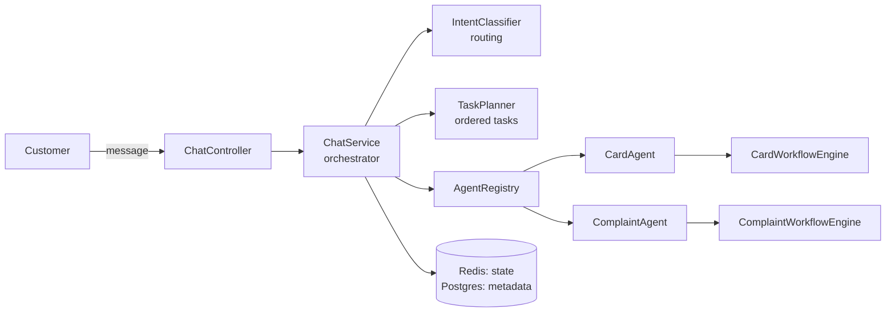

# Conversational Banking Agent

> **Let the LLM talk, let the code decide.**
> A Spring AI banking agent where the model understands the customer and deterministic,
> sealed-type workflow engines decide what actually happens.

A customer types something like:

> *"my card was stolen, block it and file a complaint"*

and the service understands both requests, plans them in the right order, asks for clarification
when needed, and only touches banking state once the code (not the model) says it is safe to.


---

## Features

- **One chat endpoint** that handles multi-intent requests in a single message.
- **Intent routing** against a fixed registry of enabled capabilities, so the model can't invent one.
- **Task planning with dependencies**: a complaint waits until the card is blocked.
- **Domain agents** (Card, Complaint) built on Spring AI `ChatClient` with `@Tool` functions.
- **Sealed workflow engines** (Java 21 `sealed interface` + exhaustive `switch`) own every state
  transition. Only the terminal state can call the backend.
- **Security guardrails in code, not prompts**:
    - the customer ID is bound per request and never passed through the model;
    - card numbers are always masked (`**** 0123`), in replies and in logs;
    - a complaint can't be filed on a bare "yes". It needs confirmed details from the current turn.
- **Mid-task intent changes**: "forget the complaint, block another card" cancels the current task
  (and its dependents) and routes the new request in the same turn.

Currently enabled capabilities: **`BLOCK_CARD`** and **`CREATE_COMPLAINT`**.

---

## How it works



Each message goes through four steps, synchronously inside one HTTP request:

1. **Route**: classify the message against the enabled capabilities.
2. **Plan**: turn matches into ordered tasks (`PENDING → READY → IN_PROGRESS → WAITING_INPUT → COMPLETED`).
3. **Execute**: hand the active task to its domain agent. The LLM calls a workflow tool; the sealed
   engine decides the outcome; the agent maps it deterministically to `COMPLETED`,
   `NEED_USER_INPUT`, `FAILED` or `INTENT_CHANGED`.
4. **Persist**: save conversation state so the next message continues where it left off.

The core rule: **the LLM handles language** (intent, ambiguity, phrasing), **the code handles state**
(what's allowed next, what's required before a side effect, and who the customer is).

For sequence diagrams, the task state machine, and the full workflow contracts, see
**[ARCHITECTURE.md](ARCHITECTURE.md)**.

---

## Tech stack

| Concern | Choice |
|---|---|
| Language | Java 21 |
| Framework | Spring Boot 4.1 (Spring MVC) |
| LLM | Spring AI 2.0 (OpenAI `ChatClient`, `@Tool` function calling) |
| Intent classification | typesafe-spring-ai (`TypeSafeClient` probability questions) |
| Session state | Redis (full conversation, 24h TTL) |
| Durable storage | PostgreSQL via Spring Data JPA (conversation metadata) |
| API docs | springdoc-openapi (Swagger UI) |
| Build | Maven wrapper |

---

## Quick start

### Prerequisites

- Java 21
- Docker (or local PostgreSQL and Redis)
- An OpenAI API key and a TypeSafe API key

### 1. Start PostgreSQL and Redis

```bash
docker run -d --name cb-postgres -p 5432:5432 \
  -e POSTGRES_DB=conversational_banking \
  -e POSTGRES_USER=postgres -e POSTGRES_PASSWORD=postgres \
  postgres:16

docker run -d --name cb-redis -p 6379:6379 \
  redis:7 redis-server --requirepass admin
```

> The Redis password is currently hardcoded to `admin` in `application.yaml`.

### 2. Set environment variables

```bash
export OPENAI_API_KEY=sk-...
export TYPESAFE_API_KEY=...

# Optional, these are the defaults
export SPRING_DATASOURCE_URL=jdbc:postgresql://localhost:5432/conversational_banking
export SPRING_DATASOURCE_USERNAME=postgres
export SPRING_DATASOURCE_PASSWORD=postgres
export SPRING_DATA_REDIS_HOST=localhost
export SPRING_DATA_REDIS_PORT=6379
```

| Variable | Purpose |
|---|---|
| `OPENAI_API_KEY` | Card and complaint agents |
| `TYPESAFE_API_KEY` | Intent classifier |
| `SPRING_DATASOURCE_*` | PostgreSQL connection |
| `SPRING_DATA_REDIS_HOST/PORT` | Redis connection |
| `PUSHOVER_API_KEY`, `PUSHOVER_USER_KEY` | Notifications (not used by any flow yet) |

### 3. Run

```bash
./mvnw spring-boot:run
```

Swagger UI: <http://localhost:8080/swagger-ui.html>

### 4. Try it

```bash
curl -X POST http://localhost:8080/api/v1/agents/bank/chat/messages \
  -H "Content-Type: application/json" \
  -d '{
        "customerId": "CUST-001",
        "message": "my card was stolen, block it and file a complaint"
      }'
```

The response contains the assistant's `message` and the current `tasks`. Keep chatting with the same
conversation to answer follow-up questions (for example, which card to block). Check Swagger UI for
the exact request and response schema.

---

## Example conversation

```
Customer: my card was stolen, block it and file a complaint
Bot:      Which card would you like to block? 1: **** 0123, 2: **** 2345
Customer: the second one
Bot:      Done, card ending 2345 is blocked (ref BLK-XXXXXXXX).
          You also asked me to create a complaint. Would you like me to continue?
Customer: yes
Bot:      Sure. Is this about the stolen card? Tell me what happened.
Customer: yes, someone used it at a shop before I noticed
Bot:      Your complaint COMP-XXXXX has been filed.
```

Note the third turn: a bare "yes" does **not** file a complaint. The complaint engine requires
confirmed details from the current turn before it will submit anything.

---

## Project structure

```
src/main/java/.../
├── chat/                  # ChatController, ChatService (orchestrator), DTOs
├── conversation/          # ConversationState + manager over Redis & Postgres
├── routing/               # CapabilityRegistry, IntentClassifier, CapabilityRouter
├── orchestration/         # Task, TaskStatus, TaskPlanner, dependency policy
├── agents/
│   ├── card/              # CardAgent, CardTools, workflow/ (sealed engine)
│   ├── complaint/         # ComplaintAgent, ComplaintTools, workflow/ (sealed engine)
│   └── customer/          # stub, future work
├── config/                # Spring AI ChatClient wiring
└── infrastructure/        # JPA, Redis, Pushover client
src/main/resources/prompts/system/   # versioned .st system prompts per agent
```

---

## Adding a new capability

1. Register it in `InMemoryCapabilityRegistry.ENABLED_CAPABILITIES`.
2. Add dependency rules (if any) in `TaskDependencyPolicyImpl`.
3. Create `agents/<domain>/` with:
    - `<Domain>Service`: business logic;
    - `<Domain>State` + `<Domain>WorkflowEngine`: a sealed-state engine that owns all transitions;
    - `<Domain>Tools`: a thin `@Tool` proxy that resolves the ambient customer and calls the engine;
    - `<Domain>Agent implements DomainAgent`: prompts the model and maps the workflow result.
4. Add a system prompt at `resources/prompts/system/<domain>-agent-v1.st`.

`AgentRegistry` picks up the new agent automatically. The orchestrator doesn't change.
See [ARCHITECTURE.md §8](ARCHITECTURE.md) for details.

---

## Known limitations

This is an experimental project, not production-ready:

- Banking services (cards, complaints) are **in-memory mocks**.
- **No automated tests yet**. The sealed engines are designed to be unit-testable, and tests are next.
- Tasks and message history live only in Redis with a **24h TTL**. An idle conversation loses its
  in-flight tasks even though the Postgres row remains.
- `CapabilityRouter` (an alternative structured-output router) is implemented but not wired in.
- `issueNewDebitCard` in `CardTools` hasn't been migrated to the workflow-engine pattern.
- The Redis password is hardcoded in `application.yaml`.

---

## Contributing

Issues, ideas and pull requests are welcome. Please read [ARCHITECTURE.md](ARCHITECTURE.md) before
your first PR. It explains the request flow and where new functionality plugs in.

## Acknowledgments

Thanks to [Abdulrhman Hasan Agha](https://www.linkedin.com/in/ahagha/) for helping shape the original idea.